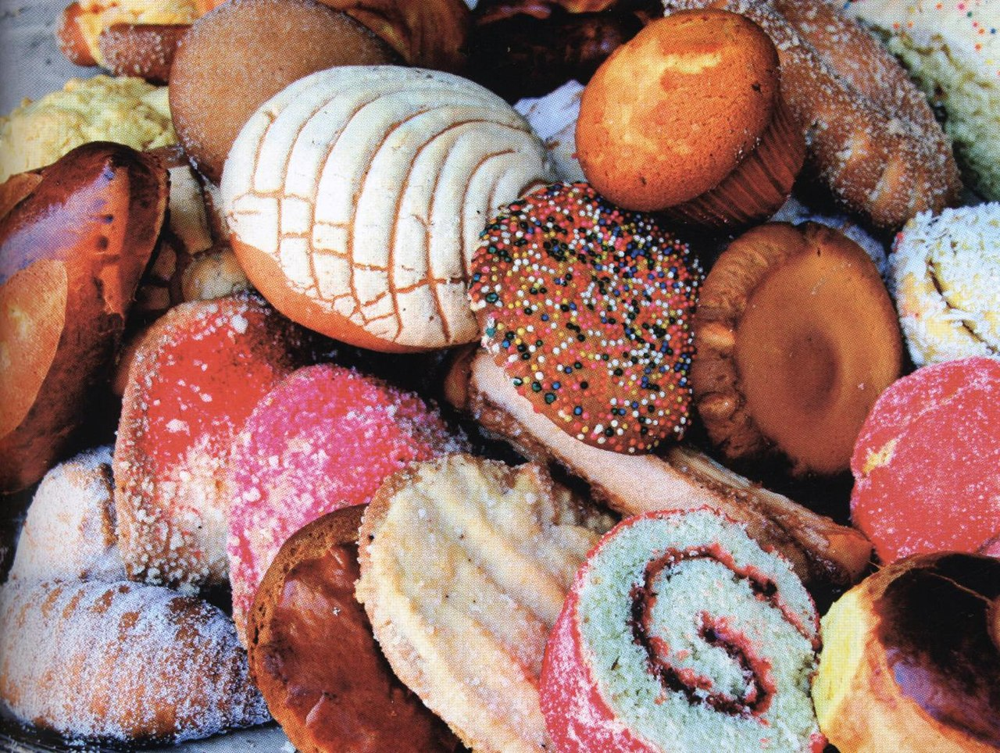
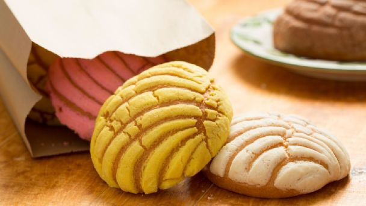
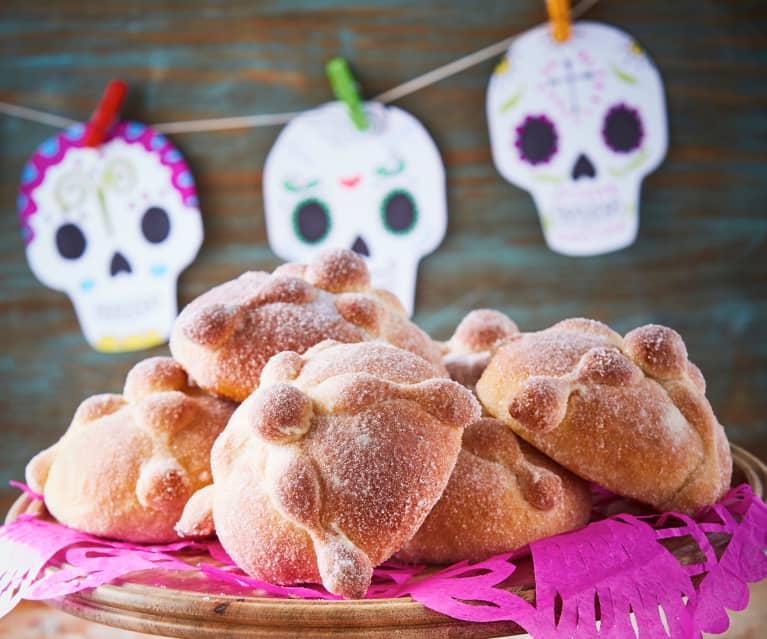
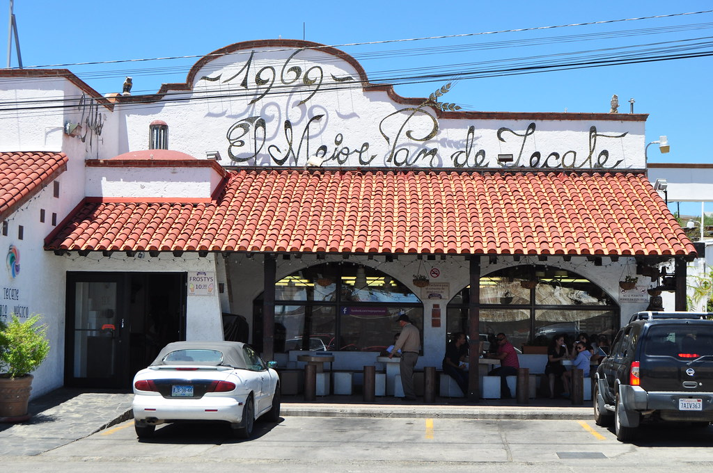
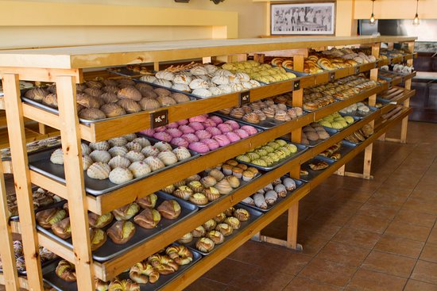

# **Classification of *Pan Dulce* using Deep Learning** :cupcake: :computer:

## **Introduction**

**Pan dulce** (Spanish for ***sweet bread***) is the general name given to a group of traditional **Mexican** pastries. It was popularized in the mid 1800s during the **French occupation** in Mexico and is usually eaten as a breakfast or after foods, and can be eaten alone or paired with **milk, hot chocolate, coffee** or **champurrado**. Pan dulce is an **essential part of Mexican cusine** and a very popular in Mexican households for it's **cheap price** and **colorful, vibrant representation** of **Mexican culture**.

|                        |
|:----------------------------------------------------------------------:|
| ***Figure 1.**  Different varieties of pan dulce*                       | 

There are many different types of pastries that are considered pan dulce, with some of the most popular being **conchitas, quequitos (or mantecadas), puerquitos, orejitas, donas**, among others. There are also some varieties of pan dulce that are **seasonal** or have a special **religious or cultural significance**, like **pan de muerto**, which is consumed around the Mexican festivity of **Dia de los Muertos** in November and offered to the dead in an altar, or **rosca de Reyes**, which is eaten on January 6th, when **Dia de los Reyes Magos** is celebrated.

|                         |   |
|:----------------------------------------------------------------------:|:-------------------------------------------:|
| ***Figure 2.**  Conchita bread*                       |***Figure 3.**  Pan de muerto* |

Pan dulce is sold in bakeries, or **panaderias**, where the pastries are displayed in racks for anyone to choose their favourite type of pan dulce, whose prices can vary between **\$10** and **\$20** pesos (**50¢** to **\$1** dollar) per piece of bread.  In the state of **Baja California** in Mexico, the city of **Tecate** has become a famous stopping point for its traditional bread, among which, there are many iconic varieties of **pan dulce**.

|                         |   |
|:----------------------------------------------------------------------:|:-------------------------------------------:|
| ***Figure 4.**  A panaderia in Tecate, Baja California*                       |***Figure 5.**  Pan dulce inside of a panaderia* |

## **Project overview**

## **Objectives**
- Create a **labeled image dataset** of some of the most popular types of pan dulce
- Train a **deep learning model** for image classification using **transfer learning**
- Deploy a simple **web application** for classification of user inputted images of pan dulce
- Write **documentation** and **project reports** that correctly showcase the work made

## **Project development**

https://david1792x-pan-dulce.streamlit.app/
## **Discussion**

## **Final remarks**
