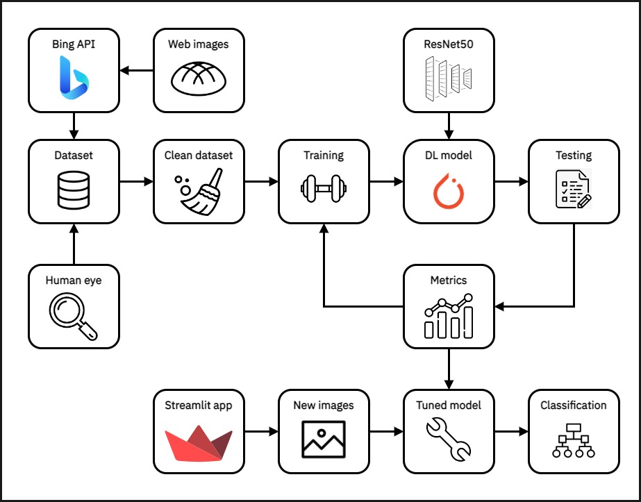

# **Classification of *Pan Dulce* using Deep Learning** :cupcake: :computer:

## **Introduction**

**Pan dulce** (Spanish for ***sweet bread***) is the general name given to a group of traditional **Mexican** pastries. It was popularized in the mid 1800s during the **French occupation** in Mexico and is usually eaten as a breakfast or after foods, and can be eaten alone or paired with **milk, hot chocolate, coffee** or **champurrado**. Pan dulce is an **essential part of Mexican cusine** and a very popular in Mexican households for it's **cheap price** and **colorful, vibrant representation** of **Mexican culture**.

|                        |
|:----------------------------------------------------------------------:|
| ***Figure 1.**  Different varieties of pan dulce*                       | 

There are many different types of pastries that are considered pan dulce, with some of the most popular being **conchitas, quequitos (or mantecadas), puerquitos, orejitas, donas**, among others. There are also some varieties of pan dulce that are **seasonal** or have a special **religious or cultural significance**, like **pan de muerto**, which is consumed around the Mexican festivity of **Dia de los Muertos** in November and offered to the dead in an altar, or **rosca de Reyes**, which is eaten on January 6th, when **Dia de los Reyes Magos** is celebrated.

|                         |   |
|:----------------------------------------------------------------------:|:-------------------------------------------:|
| ***Figure 2.**  Conchita bread*                       |***Figure 3.**  Pan de muerto* |

Pan dulce is sold in bakeries, or **panaderias**, where the pastries are displayed in racks for anyone to choose their favourite type of pan dulce, whose prices can vary between **\$10** and **\$20** pesos (**50¢** to **\$1** dollar) per piece of bread.  In the state of **Baja California** in Mexico, the city of **Tecate** has become a famous stopping point for its traditional bread, among which, there are many iconic varieties of **pan dulce**.

|                         |   |
|:----------------------------------------------------------------------:|:-------------------------------------------:|
| ***Figure 4.**  A panaderia in Tecate, Baja California*                       |***Figure 5.**  Pan dulce inside of a panaderia* |

## **Project overview**
In this project, we will use the `Bing Image Search API` to create a **small dataset** of **10** different types of **pan dulce**, and use this data to train a **convolutional neural network** that uses the `ResNet50` model as the base for an **image classifier**. Finally, the trained classifier will be used inside a simple **web application** designed using the `Streamlit` framework and deployed through **Streamlit Cloud Services** to make **classifications** based on user inputted images, and display a small description of the **predicted** type of pan dulce.

The workflow diagram of the project is shown below.

|                         |
|:----------------------------------------------------------------------:|
| ***Figure 6.**  General workflow diagram of the project*                |

## **Objectives**
- Create a **labeled image dataset** of some of the most popular types of pan dulce
- Train a **deep learning model** for image classification using **transfer learning** and **data augmentation**
- Deploy a simple **web application** for classification of user inputted images of pan dulce
- Write **documentation** and **project reports** that correctly showcase the work made

## **Project development**
### Part I. Creating an image dataset
The first step of the project is to build an **image dataset** of **10** different pan dulce types. The chosen types were **barquillo, beso, conchita, cuernito, donas, orejas, cochinito, pan de muerto, mantecada** and **Rosca de Reyes**. We used **Microsoft** `Bing Image Search API` to make different **queries** and retrieve the images for each class, **manually cleaned** the dataset and built a custom **model-friendly** version of our dataset, resulting in a small collection of around **1600** images.

 

    
|Detailed information|
|:---------------------------------------------:|
|Link to the [markdown](markdown/extracting_image_dataset.md) file|
| Link to the [Jupyter](jupyter/extracting_image_dataset.ipynb) Notebook   |

---

### Part II. Building a deep learning model
Now that we have a clean image dataset, we move on to designing a **deep learning** model for image classification using **transfer learning**. **PyTorch** was used as the machine learning framework for the project because of its popularity and flexibility, and the model consists on a **convolutional neural network** architecture based on the `ResNet50` model that was fine-tuned to serve our needs. The model is trained with an **augmented** dataset until the performance metrics are good enough for our project purposes.

 

    
|Detailed information|
|:---------------------------------------------:|
|Link to the [markdown](markdown/dl_modeling.md) file|
|Link to the [Jupyter](jupyter/dl_modeling.ipynb) Notebook|

---

### Part III. Deploying a simple web application
Finally, we use the trained deep learning model as the backbone of a simple **web application** that allows the user to upload or take a photo of a piece of pan dulce, and classifies it, giving a brief **description** of the pan dulce type as an introduction to one of the proposed applications, mentioned further on. `Streamlit` is the web application framework used to build the app because of the **ease of use** and **flexibility** it provides for **data-centric** applications. The model was deployed using **Streamlit Cloud Services** and open for anyone to use.

 

    
|Detailed information|
|:---------------------------------------------:|
|Link to the [markdown](markdown/deploy_web_app.md) file|
| Link to the [Python](streamlit/pan_dulce_app.py) script|
|Link to the [web application](https://david1792x-pan-dulce.streamlit.app/)|

---

## **Discussion**
The **deep learning** model that was designed and developed in the project achieved an accuracy of around **90%**, which is very **good** considering the amount of data available and the objectives of the project. There are many food image classification projects that achieve higher metrics by using **larger datasets** like the `Food-101` dataset and **bigger models** like `VGG19` or `VisionTransformer`, but the `ResNet50` model chosen as the base of our model performs well enough for our application while maintaining an acceptable level of **complexity**.

Some of the **areas of opportunity** for the project to improve are listed below.
- The method for extracting data using Bing Image Search API is **not very efficient** since it returns a lot of **duplicate** images and not many unique samples. A better approach with **optimized queries** should be easy to design and implement.
- The retrieved images are not very **noisy** and there are very few examples for the amount of categories in the project. A **bigger** dataset containing more webscraped images and **hand-taken photos** would greatly improve model performance, since a machine learning model is only as **good** as the data it recieves.
- There are a lot more important **types** of pan dulce that weren't included in the model for simplicity purposes. A more efficient method for building a bigger dataset would allow for **more classes** to be added to the classification model.
- The model does **not** account for images that are not pan dulce or for images of **other kinds** of pan dulce, so **incoherent predictions** are possible and should be taken into account when using the model for predictions. 
- Training was done using a **CPU** so **PyTorch's CUDA** integration could not be leveraged to improve training times. Faster times to train the model would have allowed for a more complete **comparison** between different **deep learning architectures** that wasn't done because of the long training times for every model.

## **Final remarks**
Taking into account the **objectives** of the project, the results are very **satisfactory**. This project managed to explore the **basic workflow** of a typical image processing project, all the way from **extracting the data, manually checking images** and **preprocessing** the data to **designing** a model, **training** it and quantifying its **performance**. Some key aspects of **computer vision** projects like **data augmentation, transfer learning** and **model deployment** were also integrated, resulting in an **integral, fun** and **educational** project. The complete Jupyter Notebook of the project containing the Python code of the project is linked [here](jupyter/pan_dulce_complete.ipynb) for **reproducibility** purposes (all files need to be on the same folder before running).

Finally, some proposed **future work** regarding the project is listed below.
- Create a **bigger, richer dataset** containing more types of pan dulce
- **Combine** different models to make for better **predictions**
- Expand outside the pan dulce realm and into the complete set of **traditional Mexican food**
- Implement the model into an app that can get people interested about **Mexican culture** through its **traditional foods** and strengthen sectors like the **restaurant industry** or **tourism**, among others.
