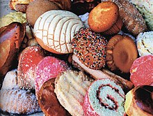
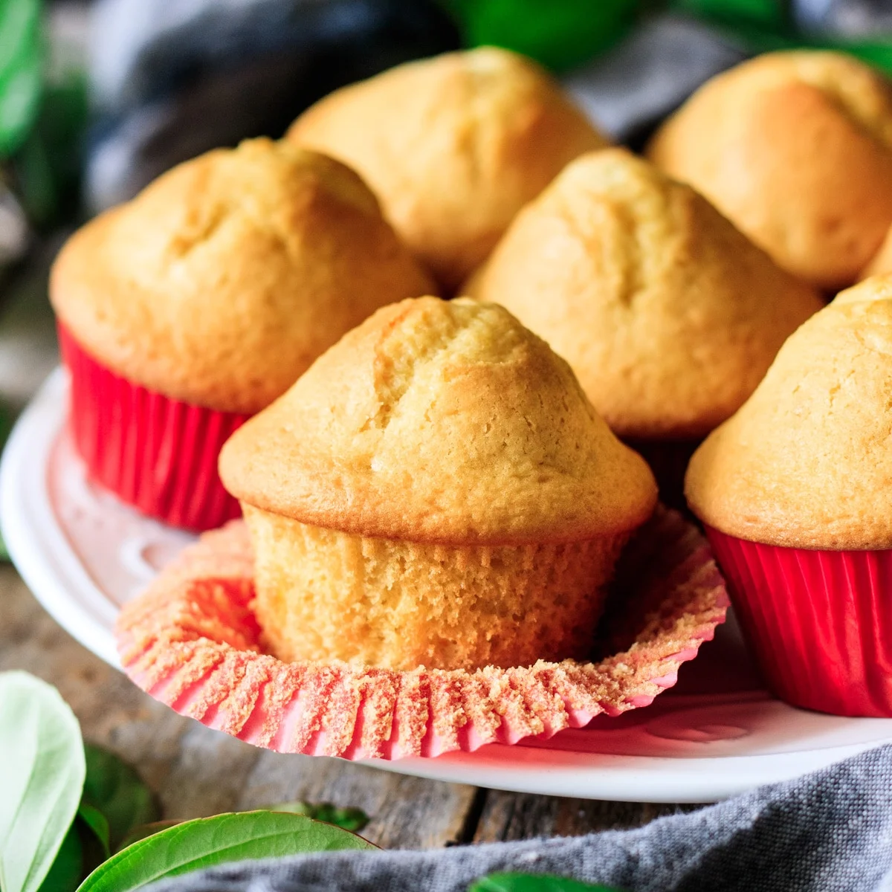

# **Classification of *Pan Dulce* using Deep Learning** :cupcake: :computer:

## **Introduction**

**Pan dulce** (Spanish for sweet bread) is the general name given to a group of traditional mexican pastries. 

|                        |
|:----------------------------------------------------------------------:|
| ***Figure 1.**  Conchitas*                       | 

|                        |    |
|:----------------------------------------------------------------------:|:-------------------------------------------:|
| ***Figure 1.**  Conchitas*                       | ***Figure 2.**  Quequitos* |

## **Project overview**

## **Objectives**
-
-
-
-

## **Project development**

## **Discussion**

## **Final remarks**
